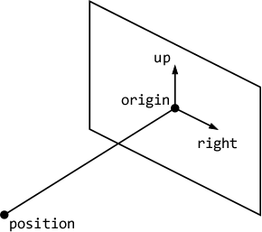

# シェーダとのデータのやりとりサンプルプログラム

## シェーダが扱うメモリ

オーソドックスなレンダリングパイプラインでは、バーテックスシェーダに頂点バッファオブジェクト (Vertex Buffer Object, VBO) のどれか一つの頂点の頂点属性が与えられ、フラグメントシェーダはフレームバッファのどれか一つのフラグメントへの書き込みを担当します。このため、バーテックスシェーダは任意の頂点属性にランダムアクセスすることはできませんし、フラグメントシェーダも任意のフラグメントにランダムアクセスすることはできません。


また、バーテックスシェーダに渡された頂点属性は読み取りのみ可能で、書き込むことはできません。フラグメントシェーダは担当するフラグメントへの書き込みを行いますが、その結果は原則的に画面表示にのみ使用されます。シェーダが扱うことのできるデータは、これらの他に `uniform` 変数やテクスチャ、それに [Buffer Texture](https://www.khronos.org/opengl/wiki/Buffer_Texture) (Texture Buffer Object) がありますが、これらも読み取り専用であり、書き込むことはできません。

シェーダが扱うメモリのこのような特徴は、プログラマブルシェーダを汎用の計算に応用する、いわゆる GPGPU において、大きな制限となります。そのため、頂点属性をバーテックスシェーダからメモリに保存する [Transform Feedback](https://www.khronos.org/opengl/wiki/Transform_Feedback) や、フラグメントの書き込み先をテクスチャに切り替える [Frame Buffer Object](https://www.khronos.org/opengl/wiki/Framebuffer_Object) などの機能が追加されましたが、いずれも汎用の計算を目的としたときには、使いやすいとは言えません。

そこで OpenGL 4.2 では、テクスチャの画素へのランダムアクセスと読み書きを可能にする [Image Load Store](https://www.khronos.org/opengl/wiki/Image_Load_Store) が導入され、続く OpenGL 4.3 では、GPU による計算処理をレンダリングパイプラインとは独立して行うことのできる[コンピュートシェーダ](https://www.khronos.org/opengl/wiki/Compute_Shader) (Compute Shader) の導入に合わせて、頂点バッファオブジェクトに対するランダムアクセスと読み書きを可能にする [Shader Strage Buffer Object](https://www.khronos.org/opengl/wiki/Shader_Storage_Buffer_Object) (SSBO) という機能が追加されました。

## Uniform Buffer Object (UBO)

`uniform` 変数は `glDrawArrays()` や `glDrawElements()` のような描画命令 (ドローコール) の実行中に不変なデータを渡すために使います。しかし、これは変数ごとに場所 (location) をあらかじめ取得しておき、シェーダの実行前にそこに値を設定する必要があります。これは `uniform` 変数の数が多くなると、結構、煩雑 ... というより、プログラムコードを見苦しいものにしてしまいます (と、少なくとも私は思います)。そこで、OpenGL 3.1 にバッファオブジェクトを `uniform` 変数として参照する [Uniform Buffer Object](https://www.khronos.org/opengl/wiki/Uniform_Buffer_Object) (UBO) という機能が追加されました。

Uniform Buffer Object は、複数のシェーダー間で共有したいデータ (例えば、カメラの位置やライティング情報など) を、あらかじめバッファオブジェクトに格納しておくための仕組みです。これにより、複数のシェーダーで同じ Uniform Buffer Object を参照できます。そのため、シェーダの実行ごとに同じ値を何度も設定する手間が省けます。また、同じ構造を持つ Uniform Buffer Object を複数用意しておけば、バッファを切り替えるだけで、シェーダーに渡すデータ群を一度に、高速に切り替えることができます。

### 構造体の作成

GLSL において、複数の変数をまとめて扱う仕組みを [Interface Block](https://www.khronos.org/opengl/wiki/Interface_Block_(GLSL)) と言います。一方、バッファオブジェクトは GPU 側のメモリブロックですから、そこに置いた個別のデータにアクセスするには、変数名などを割り当てる必要があります。そこで、このメモリの構造の定義に構造体を使います。この構造体は POD 型 (Plain Old Data type) であるか、少なくとも仮想関数を持たせることはできません。

また、GPU 上のメモリへのアクセスは、データ整列 (alignment) を意識する必要があります。Uniform Buffer Object のメモリレイアウト (`std140`) では、vec3 型はサイズが 12 バイトであっても 16 バイト境界 (16 で割り切れるメモリアドレス) に整列する必要があるため、vec3 型のデータが連続するときは、個々のデータに 1 バイト分の詰め物 (padding) が必要になります。

例えば、GLSL の次のような構造体のメモリレイアウトは、下図のようになります。

```glsl
struct Vertex
{
  // 頂点位置
  vec4 position;

  // 頂点法線ベクトル
  vec3 normal;
};
```


C++ 側の構造体において、このようなデータ整列を明示的に指定するには、`alignas` というキーワードを使います。

```cpp
struct Vertex
{
  // 頂点位置
  alignas(16) std::array<GLfloat, 4> position;

  // 頂点法線ベクトル
  alignas(16) std::array<GLfloat, 3> normal;
};
```

以降、[uboSample.cpp](uboSample.cpp) にもとづいて解説します。このプログラムでは、視点、光源、および材質について、次のような構造体を定義しています。

### 視点の構造体

構造体を定義する前に、GLSL の vec3 および vec4 に相当する、C++ のデータ型を定義しておきます。これらは [GLM](https://github.com/g-truc/glm) を導入すれば定義されますが、ここでは次のように簡単に定義しています。

```cpp
// 配列
#include <array>

/// 3 要素のベクトルデータ型
using vec3 = std::array<GLfloat, 3>;

/// 4 要素のベクトルデータ型
using vec4 = std::array<GLfloat, 4>;
```

視点とスクリーンの関係は下図のようにします。



したがって、この視点を表す構造体は、次の `Camera` のようになります。

```cpp
///
/// 視点
///
/// @note
/// スクリーンの高さを 1 として視点とスクリーンの距離
/// |rigin - position| を焦点距離に用いる
///
struct Camera
{
  /// スクリーンの原点
  alignas(16) vec3 origin;

  /// スクリーンの右方向
  alignas(16) vec3 right;

  /// スクリーンの上方向
  alignas(16) vec3 up;

  /// 視点の位置
  alignas(16) vec3 position;
};
```

この構造体 `Camera` の変数 `camera` を定義し、初期値を設定します。この初期値は中心を原点とした xy 平面上のスクリーンに画角 60° で投影するものです。

```cpp
  // 視点データ
  Camera camera
  {
    // origin
    { 0.0f, 0.0f, 0.0f },

    // right
    { 1.0f, 0.0f, 0.0f },

    // up
    { 0.0f, 1.0f, 0.0f },

    // position
    { 0.0f, 0.0f, 1.7320508f }
  };
```

Uniform Buffer Object を一つ作り、そこにこのデータを転送します。

```cpp
  // 視点のユニフォームバッファオブジェクト
  GLuint cameraUbo;
  glGenBuffers(1, &cameraUbo);
  glBindBuffer(GL_UNIFORM_BUFFER, cameraUbo);
  glBufferData(GL_UNIFORM_BUFFER, sizeof camera, &camera, GL_STATIC_DRAW);
  glBindBuffer(GL_UNIFORM_BUFFER, 0);
```

### 光源の構造体

また、光源の構造体を、次の `Light` のように定義します。

```cpp
///
/// 光源
///
struct Light
{
  // 環境光成分
  alignas(16) vec4 ambient;

  // 拡散反射光成分
  alignas(16) vec4 diffuse;

  // 鏡面反射光成分
  alignas(16) vec4 specular;

  // 位置
  alignas(16) vec4 position;
};
```

この構造体 `Light` の変数 `light` を定義します。複数の光源を扱えるように、これは配列 (`std::array`) にします。初期値には点光源を 2 つ分設定します。

なお、このような初期化には初期化並びにも構造を持たせる集成体初期化 (Aggregate initialization) を用いるべきですが、VS2022 の C++17 で Aggregate initialization しようとするとなぜかエラーになってしまうので、初期化並びをフラットなものにしています。

```cpp
  // 光源のデータ
  std::array<Light, 2> light
  {
    0.2f, 0.2f, 0.2f, 1.0f,
    1.0f, 1.0f, 1.0f, 0.0f,
    1.0f, 1.0f, 1.0f, 0.0f,
    3.0f, 4.0f, 5.0f, 1.0f,

    0.1f, 0.1f, 0.0f, 1.0f,
    0.5f, 0.5f, 0.0f, 0.0f,
    0.5f, 0.5f, 0.0f, 0.0f,
    -5.0f, 1.0f, 3.0f, 1.0f,
  };
```

Uniform Buffer Object を一つ作り、そこにこのデータを転送します。

```cpp
  // 光源のユニフォームバッファオブジェクト
  GLuint lightUbo;
  glGenBuffers(1, &lightUbo);
  glBindBuffer(GL_UNIFORM_BUFFER, lightUbo);
  glBufferData(GL_UNIFORM_BUFFER, sizeof light, &light, GL_STATIC_DRAW);
  glBindBuffer(GL_UNIFORM_BUFFER, 0);
```

### 材質の構造体

同様に、材質の構造体を、次の `Material` のように定義します。

```cpp
///
/// 材質
///
struct Material
{
  /// 環境光に対する反射係数
  alignas(16) vec4 ambient;

  /// 拡散反射反射係数
  alignas(16) vec4 diffuse;

  /// 鏡面反射反射係数
  alignas(16) vec4 specular;

  /// 輝き係数
  alignas(4) float shininess;
};
```

この構造体 `Material` の変数 `material` を定義します。これも複数の材質を扱えるように配列にします。初期値には材質を 2 つ分設定します。

```cpp
  // 材質のデータ
  std::array<Material, 2> material
  {
    0.6f, 0.1f, 0.1f, 1.0f,
    0.6f, 0.1f, 0.1f, 0.0f,
    0.3f, 0.3f, 0.3f, 0.0f,
    100.0f,

    0.1f, 0.1f, 0.6f, 1.0f,
    0.1f, 0.1f, 0.6f, 0.0f,
    0.3f, 0.3f, 0.3f, 0.0f,
    100.0f
  };
```

Uniform Buffer Object を一つ作り、そこにこのデータを転送します。

```cpp
  // 材質のユニフォームバッファオブジェクト
  GLuint materialUbo;
  glGenBuffers(1, &materialUbo);
  glBindBuffer(GL_UNIFORM_BUFFER, materialUbo);
  glBufferData(GL_UNIFORM_BUFFER, sizeof material, &material, GL_STATIC_DRAW);
  glBindBuffer(GL_UNIFORM_BUFFER, 0);
```

## Shader Strage Buffer Object (SSBO)

Uniform Buffer Object は `uniform` 変数に相当するものなので、 `uniform` 変数と同様にシェーダーから書き込むことはできません。また、Uniform Buffer Object は並列に実行されるコンピュートシェーダの個々のスレッド (一つの処理単位) に対して同じ値を提供します。

これに対して [Shader Storage Buffer Object](https://www.khronos.org/opengl/wiki/Shader_Storage_Buffer_Object) (SSBO) は、バーテックスシェーダの入力に用いる頂点バッファオブジェクトのように、スレッドごとに異なる値を提供します。また、これにはデータを書き込むことも可能です。

このプログラムでは球を描画するものとして、球の中心位置と半径、それに材質のインデックスを Shader Strage Buffer Object に格納します。これも Uniform Buffer Object と同様に GPU 側のメモリブロックですから、そこに置くデータに変数名を割り当てるのに構造体を使います。ただし、Shader Strage Buffer Object のメモリレイアウト (`std430`) では、`vec3` であっても 4 バイト境界に整列すればよいため、C++ 側で個々の `vec3` の要素に `alignas(16)` を指定する必要はありません。

**が** ... なぜか私が使用している環境では、この通りになりません。構造体の最初の要素に `alignas(16)` を付けないと、C++ と GLSL でデータ整列が一致しません。と言って、ここに `alignas(16)` を付けてしまうと、他の環境で動かなくなってしまうかもしれません。これは、例えば球のデータを vec4 にして、最初の 3 つの要素に中心位置、4 つ目の要素に半径を入れ、材質のインデックスは別のバッファオブジェクトに持たせるなどした方がいいかもしれません。ここでは、この構造体を、次の `Sphere` のように定義します。

```cpp
///
/// 球
///
struct Sphere
{
  /// 中心位置
  alignas(16) vec3 center;

  /// 半径
  float radius;

  /// 材質のインデックス
  int materialIndex;
};
```

この構造体 `Sphere` の変数 `sphere` を定義します。これも複数の球を扱えるように配列にします。初期値には材質を 2 つ分設定します。

```cpp
  // 球のデータ
  std::array<Sphere, 2> sphere
  {
    1.0f, 0.0f, -2.0f,
    1.0f,
    0,

    -1.0f, 0.0f, -1.0f,
    1.0f,
    1
  };
```

Shader Storage Buffer Object を一つ作り、そこにこのデータを転送します。

```cpp
  // 球のシェーダストレージバッファオブジェクト
  GLuint sphereSsbo;
  glGenBuffers(1, &sphereSsbo);
  glBindBuffer(GL_SHADER_STORAGE_BUFFER, sphereSsbo);
  glBufferData(GL_SHADER_STORAGE_BUFFER, sizeof sphere, &sphere, GL_STATIC_DRAW);
  glBindBuffer(GL_SHADER_STORAGE_BUFFER, 0);
```

## Image Load Store

テクスチャも Uniform Buffer Object と同様に、すべてのスレッドから共通して参照可能な、書き込みのできないデータです。また、テクスチャの参照は Texture Unit を使ってテクスチャ座標 (実数値) の位置の画素値をサンプリングするもので、隣接する画素間の中間の画素値をバイリニア補間などにより補間値として得ることができます。

Image Load Store は Image Unit を用いて画素のインデックス (整数値) によりテクスチャの画素にアクセスする機能であり、データの書き込みも可能です。このようなテクスチャは**イメージ**と呼ばれます。

まず、このイメージのサイズを決めておきます。これはレンダリングする画像のサイズになります。

```cpp
/// 出力画像の横幅
const GLsizei width{ 960 };

/// 出力画像の高さ
const GLsizei height{ 540 };
```

この大きさのテクスチャを作ります。この internal format は `GL_RGBA8` にします。これはシェーダがこのテクスチャをイメージとしてアクセスする際に、データの精度を明らかにしておく必要があるからです。

```cpp
  // フレームバッファオブジェクトのカラーバッファに使うテクスチャ
  GLuint texture;
  glGenTextures(1, &texture);
  glBindTexture(GL_TEXTURE_2D, texture);
  glTexImage2D(GL_TEXTURE_2D, 0, GL_RGBA8, width, height, 0, GL_RGBA, GL_UNSIGNED_BYTE, nullptr);
  glTexParameteri(GL_TEXTURE_2D, GL_TEXTURE_MIN_FILTER, GL_LINEAR);
  glTexParameteri(GL_TEXTURE_2D, GL_TEXTURE_MAG_FILTER, GL_LINEAR);
  glTexParameteri(GL_TEXTURE_2D, GL_TEXTURE_WRAP_S, GL_CLAMP_TO_EDGE);
  glTexParameteri(GL_TEXTURE_2D, GL_TEXTURE_WRAP_T, GL_CLAMP_TO_EDGE);
  glBindTexture(GL_TEXTURE_2D, 0);
```

このテクスチャの内容を画面に表示するために、このテクスチャをカラーバッファに使った Framebuffer Object を作ります。フレームバッファにすれば、画面表示用のフレームバッファへのデータの転送に Bit Blit (BitBLT, Bit Block Transfer) が使えます。

```cpp
  // レンダリング先のフレームバッファオブジェクト
  GLuint framebuffer;
  glGenFramebuffers(1, &framebuffer);
  glBindFramebuffer(GL_FRAMEBUFFER, framebuffer);
  glFramebufferTexture2D(GL_FRAMEBUFFER, GL_COLOR_ATTACHMENT0, GL_TEXTURE_2D, texture, 0);
  glBindFramebuffer(GL_FRAMEBUFFER, 0);
```

シェーダでこのイメージにアクセスするのに使う Image Unit の番号を決めておきます。

```cpp
  // Image Unit を設定する
  const GLuint ImageUnit{ 0 };
```

## コンピュートシェーダ

コンピュートシェーダのソースプログラム [raycast.comp](raycast.comp) について説明します。このコンピュートシェーダは 1 ワークグループあたり 1 スレッドで実行します。ワークグループやスレッドについては、例えば[ここ](https://marina.sys.wakayama-u.ac.jp/~tokoi/?date=20181018)を参考にしてみてください。

```glsl
#version 430 core
layout(local_size_x = 1, local_size_y = 1, local_size_z = 1) in;

// 背景色
uniform vec4 background = vec4(0.1, 0.2, 0.3, 0.0);
```

テクスチャに書き出すための Image Unit の `uniform` 変数を宣言します。`layout` はテクスチャの internal format (ここでは `GL_RGBA8`) と**必ず**一致させる必要があります。このテクスチャには書き出しのみ行うので、`writeonly` というキーワードを追加しています。ここに指定するキーワードには、他に `coherent`、`volatile`、`restrict`、および `readonly` があります。詳細は [Image Load Store](https://www.khronos.org/opengl/wiki/Image_Load_Store) の "Memory qualifiers" を参照してください。

- `coherent`
  - シェーダの複数のスレッドが同じメモリ (バッファオブジェクトやイメージ) にアクセスする際に、あるスレッドによる書き込みが、他のスレッドから正しく観測できることを保証します。この修飾子がない場合、あるスレッドが書き込んだ値が、別のスレッドからすぐに読み取れるとは限りません。異なるシェーダ呼び出し間でデータを安全にやり取りする場合に不可欠ですが、パフォーマンス上のオーバーヘッドが発生する可能性があります。なお、このメモリをコンピュートシェーダ以外が参照する場合は、[`glMemoryBarrier()`](https://registry.khronos.org/OpenGL-Refpages/gl4/html/glMemoryBarrier.xhtml) を使用します。
- `volatile`
  - 通常、コンパイラは、変数を介してアクセスされる値は、メモリバリアやその他の同期処理の後でのみ変更されると想定します。この修飾子を使用すると、コンパイラは、変数によって表される記憶域の内容がいつでも変更可能であると想定します。
- `restrict`
  - 通常、コンパイラは、同じシェーダー内の別々の変数から同じイメージ/バッファオブジェクトにアクセスできると想定する必要があります。そのため、ある変数に書き込み、別の変数から読み出す場合、コンパイラは書き込んだ値を読み出す可能性があると想定します。この修飾子を使用することで、このシェーダー呼び出しにおいて、この変数を通して参照可能なメモリを変更できるのは、この特定の変数のみであることをコンパイラに指示できます。可能な限りこれを使用する必要があります。
- `readonly`
  - 通常、コンパイラは変数の読み書きを自由に許可します。これを使用する場合、変数は読み取り操作のみに使用できます。アトミック操作は書き込み操作としてもカウントされるため禁止されます。また `writeonly` と同時に指定することはできません。
- `writeonly`
  - 通常、コンパイラは変数の読み書きを自由に許可します。これを使用する場合、変数は書き込み操作のみに使用できます。アトミック操作は読み取り操作としてもカウントされるため禁止されます。また `readonly` と同時に指定することはできません。

```glsl
// 画像を出力する Image Unit
layout (rgba8) writeonly restrict uniform image2D image;

// イメージのサイズ
vec2 size = vec2(imageSize(image));

// イメージの中心
vec2 center = size * 0.5;
```

視点の Uniform Buffer Object を定義します。視点は 1 つだけにしているので、このバッファオブジェクトを単一の構造体の変数として扱います。`layout` の `std140` は、このバッファオブジェクトの構造体のメモリレイアウトの指定です。これについては後で解説します。`binding = 1` の `1` は、このバッファオブジェクトの結合ポイント (Binding Point) の番号です。この番号は他のバッファの結合ポイントと重ならないよう、適当に決めます。

```glsl
// 視点
layout (std140, binding = 1) uniform Camera
{
  // スクリーンの原点
  vec3 origin;

  // スクリーンの右方向
  vec3 right;

  // スクリーンの上方向
  vec3 up;

  // 視点位置
  vec3 position;
};
```

光源は複数個扱えるようにするため、光源の構造体を `Light` として別に定義します。

```glsl
// 光源
struct Light
{
  // 環境光成分
  vec4 ambient;

  // 拡散反射光成分
  vec4 diffuse;

  // 鏡面反射光成分
  vec4 specular;

  // 位置
  vec3 position;
};
```

そして光源の Uniform Buffer Object は、この構造体 `Light` の配列として定義します。配列の要素数は**必ず**指定する必要があります。ここでは実際のデータ数 `2` を指定しますが、大きめに指定しておいて構わんのではないかと思います。確認していませんけど。

```glsl
// 光源のデータ
layout (std140, binding = 2) uniform Lights
{
  Light light[2];
};

// 光源のデータの数
uniform int lightCount = 1;
```

材質も複数個扱えるようにするため、材質の構造体を `Material` として別に定義します。

```glsl
// 材質
struct Material
{
  // 環境光の反射係数
  vec4 ambient;

  // 拡散反射係数
  vec4 diffuse;

  // 鏡面反射係数
  vec4 specular;

  // 輝き係数
  float shininess;
};
```

そして光源の Uniform Buffer Object は、この構造体 `Material` の配列として定義します。

```glsl
// 材質のデータ
layout (std140, binding = 3) uniform Materials
{
  Material material[2];
};
```

球のデータは Shader Storaage Buffer Object に格納しますが、これも構造体を `Sphere` として定義します。

```glsl
// 球
struct Sphere
{
  // 中心位置
  vec3 center;

  // 半径
  float radius;

  // 材質のインデックス
  int materialIndex;
};
```

そして球のデータの Shader Storaage Buffer Object は、この構造体 `Sphere` の配列として定義します。この配列の要素数は指定する必要はありません。なお、Shader Storaage Buffer Object に格納するデータが、例えば `vec4` 一つなら、構造体を定義せずに直接 `vec4` の配列として定義して構いません。`binding = 0` の `0` は、このバッファオブジェクトの結合ポイントの番号です。

```glsl
// 球のデータ
layout(std430, binding = 0) readonly buffer Spheres
{
  Sphere sphere[];
};

// 球のデータの数
uniform int sphereCount = 1;
```

### std140 と std430 の違い

GLSL（OpenGL Shading Language）における std140 と std430 は、Uniform Buffer Object や Shader Storage Buffer Object が保持するデータのメモリレイアウトを定義するための修飾子です。両者の主な違いはデータの詰め物 (padding) とデータ整列 (alignment) の規則にあり、これがメモリ効率と扱いやすさに影響します。std140 は厳格で C/C++ 言語との互換性が高いものの、配列や `vec3` を多用するとメモリ効率が落ちる場合があります。一方 std430 はより効率的で柔軟ですが、元々 Shader Storage Buffer Object 用に導入されたため、Uniform Buffer Object で使用する場合は拡張機能で対応している必要があります。

### 交差判定

球と視線の交差判定を行う関数 `intersection` を定義します。この説明はこのサンプルプログラムの本題ではないので割愛します。

```glsl
float intersection(in Sphere s, in vec3 p, in vec3 v)
{
  vec3 f = p - s.center;
  float a = dot(v, v);
  float b = dot(f, v);
  float c = dot(f, f) - s.radius * s.radius;
  float d = b * b - a * c;
  return d < 0.0 ? -1.0 : (-b - sqrt(d)) / a;
}
```

このコンピュートシェーダのワークグループは、出力するイメージの画素ごとに起動するものとします。したがって、ワークグループの番号の xy 成分が、担当する画素のインデックスになります。

```glsl
void main()
{
  // ワークグループ ID をそのまま画素のインデックスに使う
  const ivec2 xy = ivec2(gl_WorkGroupID);
```

画素のインデックス `xy` から、スクリーン上の座標値 `st` を求め、視点の位置 `position` からその点のワールド座標上の位置に向かう視線の向き `direction` を求めます。

```glsl
  // 視点から画素に向かうベクトルを求める
  const vec2 st = (vec2(xy) - center) / center.y;
  const vec3 direction = origin + right * st.s + up * st.t - position;
```

そして、視線とすべての球のデータとの間で交差判定を行い、交点までの距離 `t` を求めます。

```glsl
  // 最小距離
  float tmin = 3.402823466e+38;

  // 交点を持つ球のデータの番号
  int hit = -1;

  // 全ての球のデータについて
  for (int i = 0; i < sphereCount; ++i)
  {
    // 交点までの距離を求める
    float t = intersection(sphere[i], position, direction);
```

視線と交差する球のうち、最も視点との距離 `t` が短いものを、その視線において可視となる球の候補とします。

```glsl
    // 交差していなければ次の球へ
    if (t < 0.0) continue;

    // 交差している球の中で最も近いものを選ぶ
    if (t < tmin)
    {
      tmin = t;
      hit = i;
    }
  }
```

視線がどの球とも交差していなければ、背景色を表示します。

```glsl
  // 交差していなければ背景色を設定
  if (hit < 0)
  {
    imageStore(image, xy, background);
    return;
  }
```

視線と球の交点のうち、視点に最も近い交点のワールド座標 `p` を求めます。また、球の中心からその点に向かうベクトルを、その点の法線ベクトル `n` とします。視線単位ベクトル `v` には視線ベクトル `direction` を正規化したものを用います。

```glsl
  // 交点の位置
  vec3 p = position + tmin * direction;

  // 交点の法線単位ベクトル
  vec3 n = normalize(p - sphere[hit].center);

  // 視線単位ベクトル
  vec3 v = normalize(direction);

  // 材質のインデックス
  int mat = sphere[hit].materialIndex;
```

この点における、すべての光源に対する反射光強度を求めて合計します。

```glsl
  // 反射光強度
  vec4 intensity = vec4(0.0);

  for (int i = 0; i < lightCount; ++i)
  {
    // 交点から見た光源単位ベクトル
    vec3 l = normalize(light[i].position - p);

    // 中間ベクトル (視線ベクトル v の向きが反対なので)
    vec3 h = normalize(l - v);

    // 陰影計算
    vec4 ambient = material[mat].ambient * light[i].ambient;
    vec4 diffuse = max(dot(n, l), 0.0) * material[mat].diffuse * light[i].diffuse;
    vec4 specular = pow(max(dot(n, h), 0.0), material[mat].shininess) * material[mat].specular * light[i].specular;

    // 反射光強度の合計
    intensity += ambient + diffuse + specular;
  }
```

最後に、合計した反射光強度 `intensity` をイメージ `image` に書き込みます。

```glsl
  // 画素に書き込む
  imageStore(image, xy, intensity);
}
```

## コンピュートシェーダの実行

まず、コンピュートシェーダのソースプログラム raycast.comp をコンパイル・リンクして、プログラムオブジェクト `shader` を作ります。

```cpp
  // コンピュートシェーダ
  const auto shader{ ggLoadComputeShader("raycast.comp") };
```

このプログラムオブジェクト `shader` から、光源の数の `uniform` 変数 `lightCount`、球のデータの数の `uniform` 変数 `sphereCount`、および Image Unit の `uniform` 変数 `image` の場所を取り出しておきます。

```cpp
  // uniform 変数の場所
  const auto lightCountLoc{ glGetUniformLocation(shader, "lightCount") };
  const auto sphereCountLoc{ glGetUniformLocation(shader, "sphereCount") };
  const auto imageLoc{ glGetUniformLocation(shader, "image") };
```

描画ループの中で、使用するバッファオブジェクトを結合ポイントに結合します。結合ポイントの番号はシェーダのソースプログラムの `layout` 修飾子の `location` で指定したものです。

```cpp
    // 球のデータのシェーダストレージバッファオブジェクトを 0 番の結合ポイントに結合する
    glBindBufferBase(GL_SHADER_STORAGE_BUFFER, 0, sphereSsbo);

    // 視点のユニフォームバッファオブジェクトを 1 番の結合ポイントに結合する
    glBindBufferBase(GL_UNIFORM_BUFFER, 1, cameraUbo);

    // 光源のユニフォームバッファオブジェクトを 2 番の結合ポイントに結合する
    glBindBufferBase(GL_UNIFORM_BUFFER, 2, lightUbo);

    // 材質のユニフォームバッファオブジェクトを 3 番の結合ポイントに結合する
    glBindBufferBase(GL_UNIFORM_BUFFER, 3, materialUbo);
```

> 結合ポイントをシェーダのソースプログラムで指定していしない場合は、あらかじめシェーダのプログラムオブジェクト (`shader`) から [`glGetProgramResourceIndex()`](https://registry.khronos.org/OpenGL-Refpages/gl4/html/glGetProgramResourceIndex.xhtml) (`uniform` ブロックの場合は [`glGetUniformBlockIndex()`](https://registry.khronos.org/OpenGL-Refpages/gl4/html/glGetUniformBlockIndex.xhtml) でも可) を使って `uniform` ブロックや `buffer` ブロックの名前 (`Camera` とか `Spheres` とか) のインデックスを取り出し、それを適当に決めた結合ポイントに、`uniform` ブロックの場合は [`glUniformBlockBinding()`](https://registry.khronos.org/OpenGL-Refpages/gl4/html/glUniformBlockBinding.xhtml)、`buffer` ブロックの場合は [`glShaderStorageBlockBinding()`](https://registry.khronos.org/OpenGL-Refpages/gl4/html/glShaderStorageBlockBinding.xhtml) を使って結び付けておく必要があります。

コンピュートシェーダのプログラムオブジェクト `shader` を指定して、`uniform` 変数に値を設定します。

```cpp
    // コンピュートシェーダを指定する
    glUseProgram(shader);

    // 光源のデータの数と球のデータの数を指定する
    glUniform1i(lightCountLoc, static_cast<GLint>(light.size()));
    glUniform1i(sphereCountLoc, static_cast<GLint>(sphere.size()));
```

Image Unit の `uniform` 変数 `image` にも、結合ポイントの番号を設定します。また、その結合ポイントにはイメージに使うテクスチャを結合します。`GL_WRITE_ONLY` や `GL_RGBA8` はシェーダのソースプログラムでの指定に合わせます。

```cpp
    // 書き込み先のイメージを指定する
    glUniform1i(imageLoc, ImageUnit);

    // texture を image unit に結合する
    glBindImageTexture(ImageUnit, texture, 0, GL_FALSE, 0, GL_WRITE_ONLY, GL_RGBA8);
```

イメージの個々の画素にワークグループを割り当てて、コンピュートシェーダを起動します。

```cpp
    // ワークグループを画素ごとに起動する
    glDispatchCompute(width, height, 1);
```

コンピュートシェーダがイメージのすべての画素へのデータの書き込みを完了するのを待ちます。

```cpp
    // シェーダの実行が完了するまで待機する
    glMemoryBarrier(GL_SHADER_IMAGE_ACCESS_BARRIER_BIT);
```

イメージが完成したら、書き込み先のテクスチャ `texture` の Image Unit との結合を解除し、使ったシェーダのプログラムオブジェクトの指定を解除し、Shader Storage Buffer Object や Uniform Buffer Object の結合を解除します ... が、別に解除せずに次の結合を行っても構わないので、これらはなくても動きます。

```cpp
    // イメージの結合を解除する
    glBindImageTexture(ImageUnit, 0, 0, GL_FALSE, 0, GL_WRITE_ONLY, GL_RGBA8);

    // シェーダの使用を終了する
    glUseProgram(0);

    // シェーダストレージバッファオブジェクトの結合を解除する
    glBindBufferBase(GL_SHADER_STORAGE_BUFFER, 0, 0);

    // ユニフォームバッファオブジェクトの結合を解除する
    glBindBufferBase(GL_UNIFORM_BUFFER, 1, 0);
    glBindBufferBase(GL_UNIFORM_BUFFER, 2, 0);
    glBindBufferBase(GL_UNIFORM_BUFFER, 3, 0);
```

最後に、フレームバッファの読み出し基をこのテクスチャ `texture` をカラーバッファに持っているフレームバッファに切り替えて、その内容を画面表示のフレームバッファに Bit Blit により転送します。`glBlitFramebuffer()` の最後の引数は転送時の画素の補間方法で、`GL_NEAREST` か `GL_LINEAR` が指定できます。

```cpp
    // シーンを描画する
    glBindFramebuffer(GL_READ_FRAMEBUFFER, framebuffer);
    glBlitFramebuffer(0, 0, width, height, 0, 0, width, height, GL_COLOR_BUFFER_BIT, GL_LINEAR);
    glBindFramebuffer(GL_READ_FRAMEBUFFER, 0);
```


ということで、OpenGL でもドローコールを一切使わずにレンダリングすることは可能です。
